# Learning Dual-Domain Multi-Scale Representations for Single Image Deraining


[](http://arxiv.org/abs/2503.12014)
[]()
[](https://zs1314.github.io/DMSR/)

#### 🔥🔥🔥 News
- **2025-02-10:** This repo is released.

---

> **Abstract:** Existing image deraining methods typically rely on
single-input, single-output, and single-scale architectures, which
overlook the joint multi-scale information between external and
internal features. Furthermore, single-domain representations are
often too restrictive, limiting their ability to handle the complexities of real-world rain scenarios. To address these challenges, we
propose a novel Dual-Domain Multi-Scale Representation Network
(DMSR). The key idea is to exploit joint multi-scale representations
from both external and internal domains in parallel while
leveraging the strengths of both spatial and frequency domains to
capture more comprehensive properties. Specifically, our method
consists of two main components: the Multi-Scale Progressive
Spatial Refinement Module (MPSRM) and the Frequency Domain
Scale Mixer (FDSM). The MPSRM enables the interaction and
coupling of multi-scale expert information within the internal
domain using a hierarchical modulation and fusion strategy. The
FDSM extracts multi-scale local information in the spatial domain,
while also modeling global dependencies in the frequency domain.
Extensive experiments show that our model achieves state-of-theart performance across six benchmark datasets.

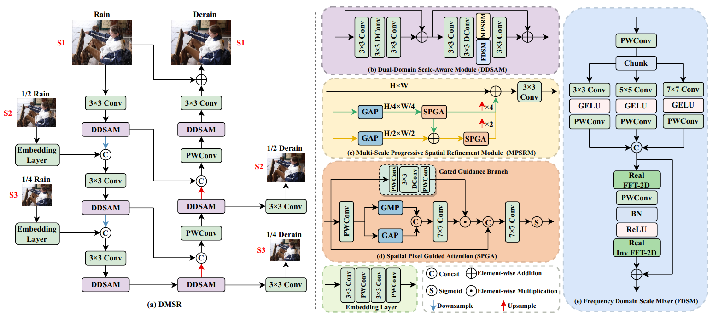

---


## ⚙️ Dependencies

- Python 3.8
- PyTorch 1.9.0
- NVIDIA GPU + [CUDA](https://developer.nvidia.com/cuda-downloads)

```bash
# Clone the github repo and go to the default directory 'DMSR'.
git clone https://github.com/zs1314/DMSR.git
conda create -n DMSR python=3.8
conda activate DMSR
pip install matplotlib scikit-image opencv-python yacs joblib natsort h5py tqdm
```
Install warmup scheduler
```bash
cd pytorch-gradual-warmup-lr; python setup.py install; cd ..
```
## ⚒️ TODO

* [x] Release code
* [x] Release pretrained models


## 🔗 Contents

1. [Datasets](#datasets)
1. [Training](#training)
1. [Testing](#testing)
1. [Results](#results)
1. [Citation](#citation)
1. [Contact](#contact)
1. [Acknowledgements](#acknowledgements)

---


## <a name="datasets"></a>🖨️ Datasets

Used training and testing sets can be downloaded as follows:

| Training Set                                                                                                                                                                                                           |                                                                                                                    Testing Set                                                                                                                    |                        Visual Results                        |
|:-----------------------------------------------------------------------------------------------------------------------------------------------------------------------------------------------------------------------|:-------------------------------------------------------------------------------------------------------------------------------------------------------------------------------------------------------------------------------------------------:| :----------------------------------------------------------: |
| Rain13K[complete training dataset: [Google Drive](https://drive.google.com/drive/folders/1Hnnlc5kI0v9_BtfMytC2LR5VpLAFZtVe) / [Baidu Disk](https://pan.baidu.com/s/1uYgoetlYGK_iOQ4XMbRExw?pwd=wzkw)]     | Test100 + Rain100H + Rain100L + Test2800 + Test1200 [complete testing dataset: [Google Drive](https://drive.google.com/drive/folders/1PDWggNh8ylevFmrjo-JEvlmqsDlWWvZs) / [Baidu Disk](https://pan.baidu.com/s/1uYgoetlYGK_iOQ4XMbRExw?pwd=wzkw)] | [Google Drive]() / [Baidu Disk]() |

Download training and testing datasets and put them into the corresponding folders of `Datasets/`. See [Datasets](Datasets/README.md) for the detail of the directory structure.


## <a name="training"></a>🔧 Training

- Download [training](https://pan.baidu.com/s/1uYgoetlYGK_iOQ4XMbRExw?pwd=wzkw) (Rain13K, already processed) and [testing](https://pan.baidu.com/s/1uYgoetlYGK_iOQ4XMbRExw?pwd=wzkw) (Test100 + Rain100H + Rain100L + Test2800 + Test1200 , already processed) datasets, place them in `Datasets/`.

- Run the following scripts. The training configuration is in `training.yml`.

  ```shell
  python train.py
  ```

- The training experiment is in `checkpoints/`.


## <a name="testing"></a>🔨 Testing


 
- Download [testing](https://pan.baidu.com/s/1uYgoetlYGK_iOQ4XMbRExw?pwd=wzkw) (Test100 + Rain100H + Rain100L + Test2800 + Test1200) datasets, place them in `Datasets/`.

- Run the following scripts. The testing configuration is in `test.py`.

  ```shell
    python test.py
  ```

- The output is in `results/`.
- To reproduce PSNR/SSIM scores of the paper, run (in matlab):
  ```shell
    evaluate_PSNR_SSIM.m 
  ```

## <a name="results"></a>🔎 Results

We achieve state-of-the-art performance. Detailed results can be found in the paper.

<details>
<summary>Quantitative Comparison (click to expand)</summary>

- results in Table 1 of the main paper

<p align="center">
  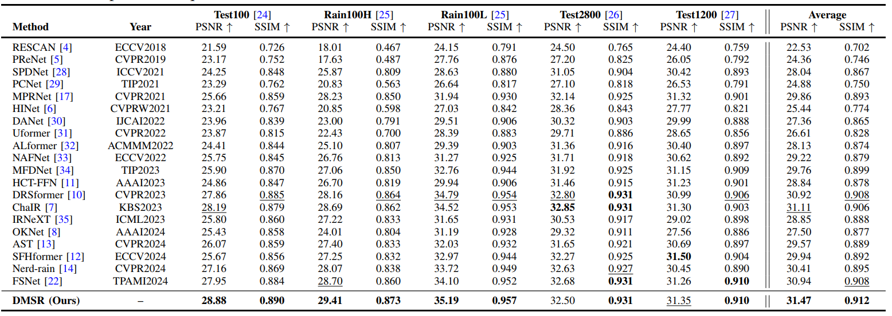
</p>

- results in Table 2 of the main paper

<p align="center">
  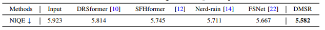
</p>

- results in Table 2 of the supplementary material

<p align="center">
  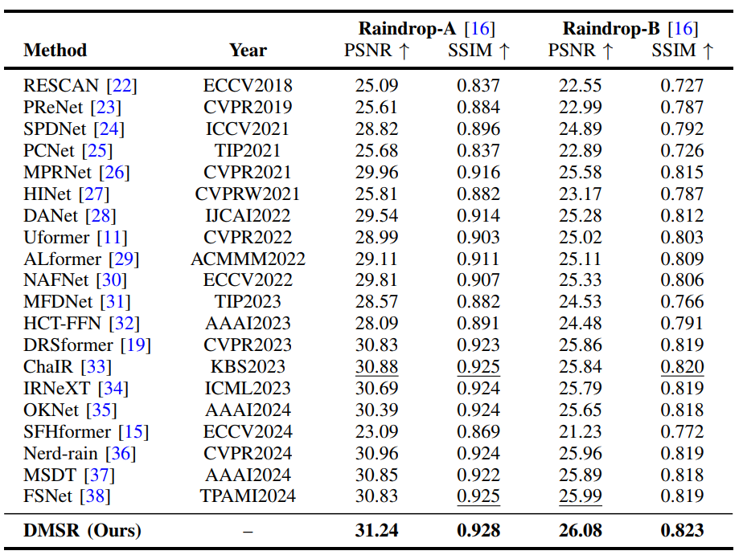
</p>

- results in Table 1 of the supplementary material

<p align="center">
  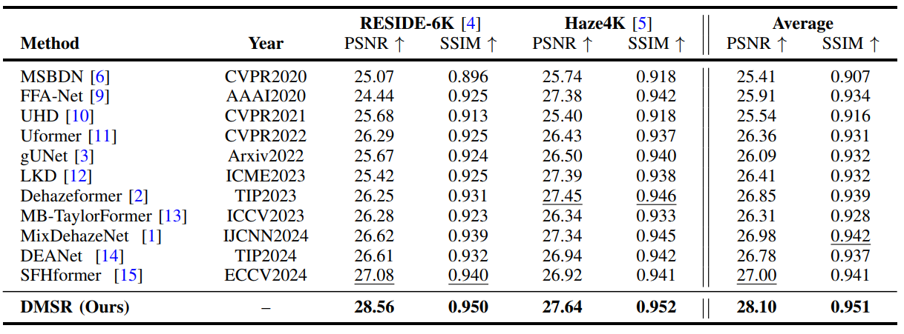
</p>

- results in Table 3 of the supplementary material

<p align="center">
  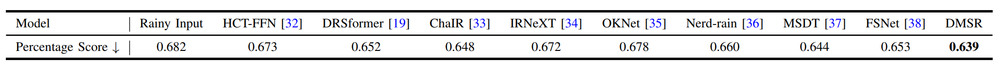
</p>
</details>

<details>
<summary>Visual Comparison (click to expand)</summary>

- results in Figure 2 of the main paper

<p align="center">
  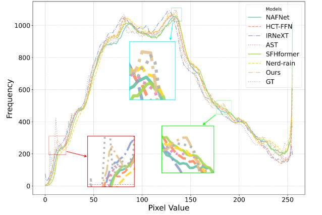
</p>


- results in Figure 3 of the main paper

<p align="center">
  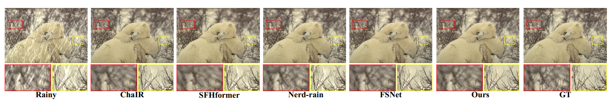
</p>


- results in Figure 4 of the main paper

<p align="center">
  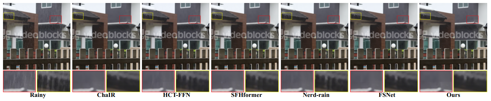
</p>

- results in Figure 1 of the supplementary material

<p align="center">
  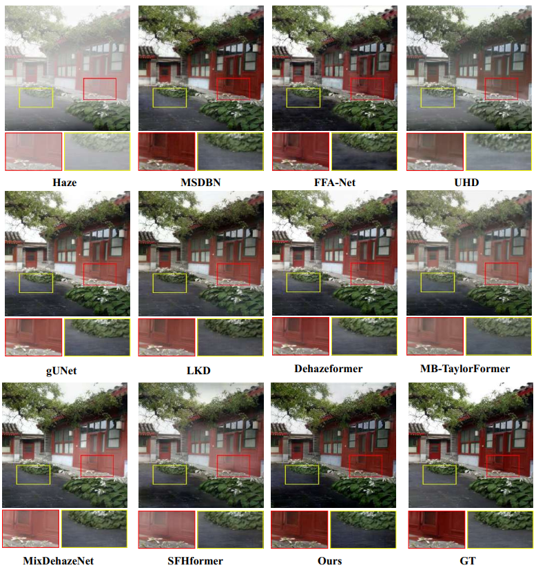
</p>

- results in Figure 2 of the supplementary material

<p align="center">
  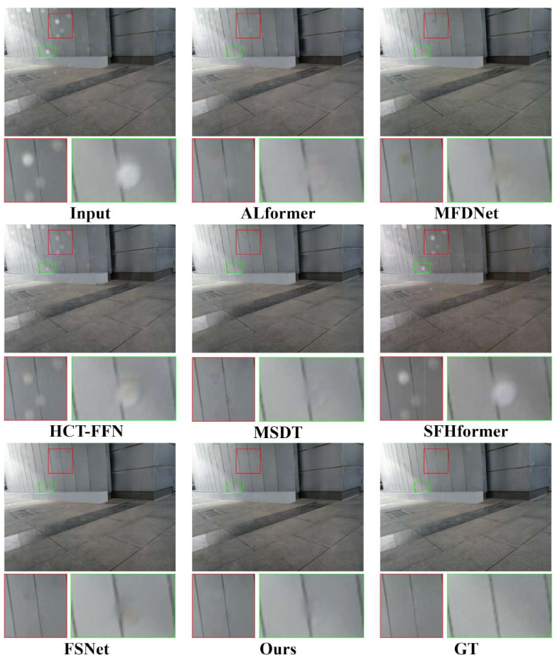
</p>

</details>

## <a name="contact"></a>📂 Contact
Should you have any question, please contact shunzou.njau@gmail.com


## <a name="citation"></a>📎 Citation

We kindly request that you cite our work if you utilize the code or reference our findings in your research:
```
@inproceedings{zou2025dmsr,
  title={Learning Dual-Domain Multi-Scale Representations for Single Image Deraining},
  author={Zou, Shun and Zou, Yi and Zhang, Mingya and Luo, Shipeng and Gao, Guangwei and Qi, Guojun},
  booktitle={},
  year={2025}
}
```


## <a name="acknowledgements"></a>💡 Acknowledgements

This code is built on [MPRNet](https://github.com/swz30/MPRNet), [ChaIR](https://github.com/c-yn/ChaIR).

